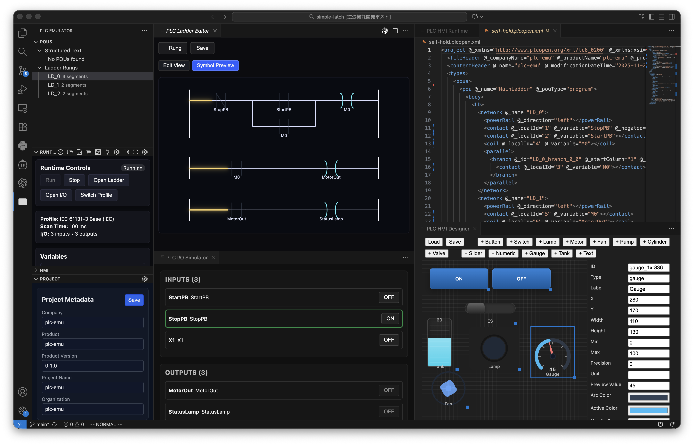

# ⚡ plc-emu — An Open Playground for PLCs, OT, and AI Agents

Run and debug IEC‑style PLC logic on a plain laptop, store your projects in Git as human‑readable PLCopen XML, and give AI agents a place to learn industrial control without touching a single real machine.

This repository contains a VS Code extension that turns PLC engineering into something you can do on a Saturday afternoon with a coffee instead of a million‑dollar test bench.

> Important: this is an emulator for learning, experimentation, and research. It is **not** intended to drive real equipment or safety‑critical systems.

---

## Why This Project Exists 💡

### 1. OT is full of "open" things that aren’t really open 🔓

Industrial control and OT (Operational Technology) are full of specs and products with "Open" in the name. In practice:

- Toolchains are vendor‑locked, license‑gated, and often tied to specific Windows versions.
- Even "open" formats are hard to obtain, hard to read, or wrapped in proprietary tooling.
- Just learning PLC programming usually requires buying hardware, licenses, and vendor IDEs.

That friction slows down learning, experimentation, and community‑driven progress. This project tries to provide a genuinely open, low‑friction environment where anyone can explore PLC ideas with nothing more than VS Code and Node.js.

### 2. Let AI agents do PLC engineering, too 🤖

Today, AI agents can happily write Python or JavaScript but struggle with PLCs because:

- The tools are not scriptable or headless.
- The formats are messy or undocumented.
- There is no cheap, safe runtime they can freely experiment against.

By representing PLC programs as clean PLCopen XML in Git, and exposing a JSON‑RPC runtime host, this project aims to make PLC engineering just as agent‑friendly as web or backend work. The long‑term vision is:

- **20x productivity** via agents that can generate, simulate, and refactor ladder/ST code.
- **Self‑healing plants** where agents help with diagnostics, regression tests, and maintenance.
- **Democratized OT education** so anyone can learn PLC concepts without vendor lock‑in or hardware.

---

## What You Can Do Today 🧪

With this extension you can already:

- **Edit PLCopen XML projects** and treat the XML as the single source of truth.
- **Work with Structured Text (ST)** using VS Code’s native editor, syntax highlighting, and snippets.
- **Edit ladder diagrams visually** in a webview ladder editor backed by PLCopen LD.
- **Run a lightweight scan‑cycle emulator** that executes ST + ladder logic and exposes internal variables.
- **Simulate digital I/O** with an I/O simulator panel (virtual inputs/outputs instead of real wires).
- **Experiment with an HMI designer/runtime** that binds widgets to the same simulated I/O and variables.
- **Keep everything in Git/GitHub** as regular text files (PLCopen XML + JSON), so reviews, diffs, and CI are natural.

All of this runs locally, offline, on a general‑purpose machine. ✨

### UI at a Glance 🖼️

Here’s a snapshot of a simple latch project running entirely inside VS Code — ladder editor, runtime controls, I/O simulator, and HMI designer all wired together:



---

## Roadmap & Milestones 🗺️

High‑level goals, expressed as a checklist so you can see where things are headed.

### Core tooling

- [x] VS Code extension scaffolded and activatable via commands.
- [x] PLCopen XML parser/serializer with an in‑memory project model.
- [x] Structured Text grammar, snippets, and mirrored `.st` files under `.plc/st/`.
- [x] Ladder editor webview with basic contacts/coils and parallel branches.
- [x] IEC‑style scan‑cycle emulator (ST + ladder subset).
- [x] I/O simulator panel wired into the runtime.
- [x] Project tree view with POUs and ladder rungs.
- [ ] Breakpoints, stepping, and richer watch views.
- [ ] First‑class diagnostics for ladder (not just ST).

### Openness & interoperability

- [x] Single source of truth: PLCopen XML stored in the workspace.
- [x] Git‑friendly structure: everything is plain text; no opaque binary project files.
- [ ] Profiles for common vendor dialects (timers, counters, vendor FBs).
- [ ] Export pipelines that emit vendor‑specific PLCopen variants.
- [ ] Reference converters to import/export from major PLC IDEs.

### AI & agents

- [x] External runtime host with JSON‑RPC so tools and agents can drive the emulator.
- [ ] Stable, documented API surface for agents (introspect model, run tests, apply patches).
- [ ] Example agent workflows ("generate ladder from spec", "auto‑tune timings", "add safety checks").
- [ ] CI recipes that run the emulator headless to regression‑test PLC logic.

### Future possibilities

- [ ] Production‑grade runtime with predictable timing and robust error handling.
- [ ] Hardware bridges to talk to real PLCs or soft‑PLCs (for lab use only).
- [ ] Cloud runners for large‑scale simulation (e.g., order scheduling, what‑if analysis).
- [ ] A library of open, reusable PLC function blocks maintained like any other OSS library.

The implementation details behind many of these items live in `docs/implementation-plan.md`.

---

## Quick Start 🚀

Requirements:

- Node.js (LTS recommended)
- VS Code 1.89 or later

Install dependencies and compile the extension:

```bash
npm install
npm run compile
npm test   # optional, runs Vitest suite
```

Then open this folder in VS Code and start the Extension Development Host:

1. Press `F5` in VS Code.
2. In the new window, run the command **PLC Emulator: Open PLCopen Project** to open or create a `project.plcopen.xml` file.
3. Explore the **PLC Emulator** view in the Activity Bar to browse POUs and open the ladder/ST editors.

### Everyday workflow

Once the project is open you can:

1. **Edit Structured Text**
   - Run **PLC Emulator: Edit Structured Text Block**.
   - The extension mirrors the block into `.plc/st/<POU>.st` so you can edit it like any other code file.
   - On save, changes are pushed back into the PLCopen XML.

2. **Edit ladder diagrams**
   - Run **PLC Emulator: Open Ladder Editor**.
   - Use the visual editor to add contacts, coils, and branches.
   - Save to write updated LD networks back into the PLCopen project.

3. **Run the emulator**
   - Use **PLC Emulator: Run Program** / **Stop Program** or the toolbar buttons.
   - Watch variable snapshots in the *PLC Emulator* output channel and status bar.
   - Open **PLC Emulator: Open I/O Simulator** to toggle digital inputs and observe outputs.

4. **Experiment with HMI**
   - Use **PLC Emulator: Open HMI Designer** to lay out basic widgets (buttons, lamps, sliders, etc.).
   - Use **PLC Emulator: Open HMI Runtime** to see them bound to the simulated PLC variables.
   - HMI configuration is stored in a JSON file controlled by `plcEmu.hmiFile` (defaults to `.plc/hmi.json`).

---

## External Runtime Host (for tools and agents) 🔌

The emulator can also run in a separate process so tools and AI agents can connect without depending on VS Code internals.

- Set `"plcEmu.runtimeMode": "external"` in your VS Code settings.
- Run the host manually with:

  ```bash
  npm run host
  ```

- Or let the extension spawn it automatically when needed.

The host exposes both stdio and a TCP socket (`127.0.0.1:8123` by default), speaking a simple JSON‑RPC protocol so external processes (agents, CI jobs, CLI tools) can:

- Load PLCopen projects
- Start/stop the runtime
- Read/write variables and I/O

For quick manual experiments:

```bash
npm run plcrun -- ping
```

See `docs/runtime-host-cli.md` for protocol details and examples.

---

## Project Layout 🗂️

- `src/extension.ts` – extension activation and command wiring.
- `src/services/plcopenService.ts` – PLCopen XML parsing/serialization and in‑memory project model.
- `src/ladder/ladderPanel.ts` & `media/ladder` – ladder editor webview and SVG rendering.
- `src/runtime/emulator.ts` – in‑process scan‑cycle emulator.
- `src/runtime/host/*` – external runtime host and client CLI.
- `src/io/*` – I/O simulation services and webview panels.
- `src/views/*` – POU tree, runtime controls, project editor, HMI launcher.
- `src/hmi/*` & `media/hmi-*` – HMI designer and runtime.
- `syntaxes/` & `language-configuration.json` – ST language configuration and grammar.
- `test/` – Vitest tests and fixtures under `test/fixtures/`.
- `examples/` – sample PLCopen XML and HMI JSON.
- `.plc/` – generated mirrors (`.st` files, HMI JSON by default); treated as ephemeral and git‑ignored.

---

## Limitations & Non‑Goals (for now) ⚠️

This project is intentionally small and hackable. Some important caveats:

- **Learning only** – The emulator is not suitable for real‑world control of machinery or safety‑critical systems.
- **Partial PLCopen coverage** – Only a subset of the PLCopen schema is supported today.
- **Simplified instruction set** – Many instructions/function blocks are not implemented yet.
- **No hardware integration** – All I/O is simulated; there is no fieldbus or driver stack.
- **Performance is "good enough" for a laptop lab**, not tuned for hard real‑time.

If you need to ship a factory tomorrow, use a certified PLC platform. If you want to understand how PLCs work, teach others, or give agents something safe to break, you’re in the right place.

---

## Contributing 🤝

This is still a prototype, but contributions are welcome:

- Bug reports, ideas, and UX feedback for the ladder editor and emulator.
- Improvements to PLCopen handling and vendor dialect profiles.
- Examples and teaching materials built on top of this emulator.

Before sending a PR:

1. Run `npm run compile`.
2. Run `npm test`.
3. Prefer small, focused changes with clear commit messages.

For contributor workflow and repository operations, see:
- `AGENTS.md` (engineering and `gh`-based PR workflow)
- `CONTRIBUTING.md` (day-to-day contribution steps)
- `docs/ci-cd.md` (CI/CD pipeline behavior)
- `docs/release-versioning.md` (SemVer and release policy)

---

## License

This project is licensed under the MIT License. See `LICENSE` (or the repository metadata) for details.
